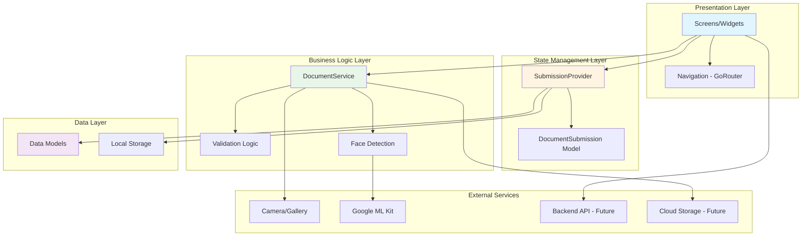
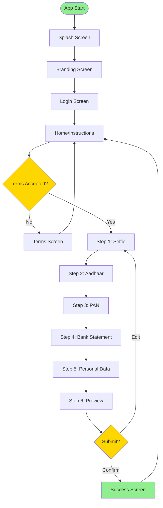
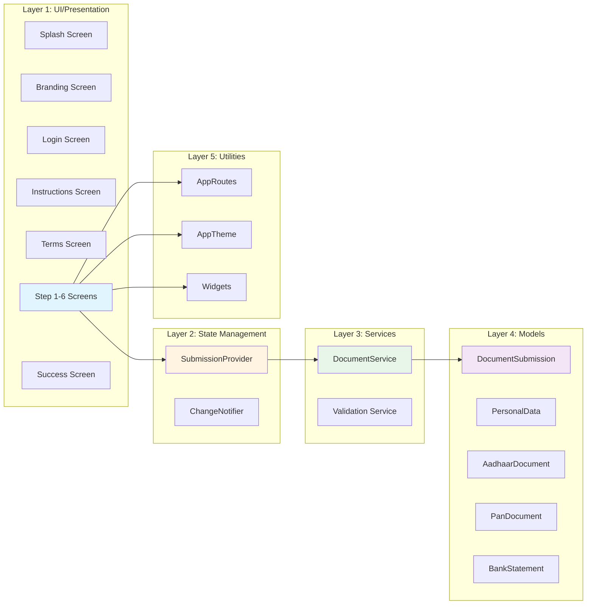
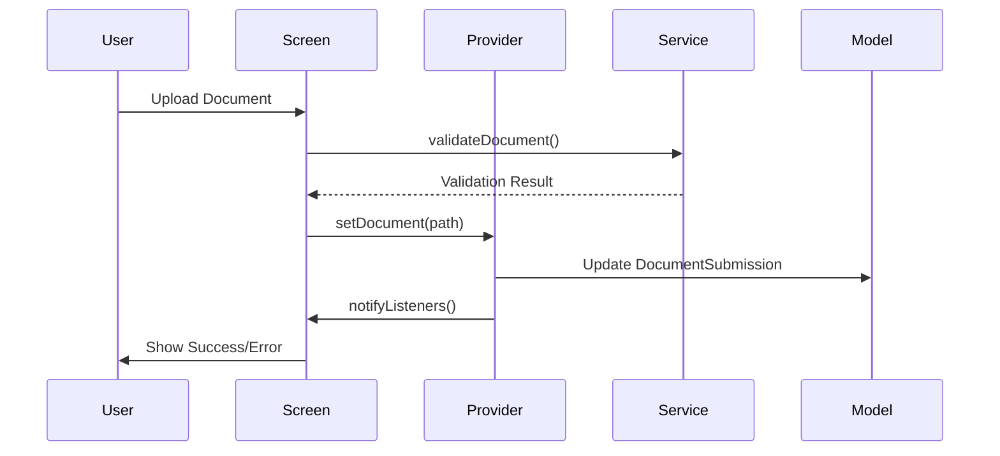
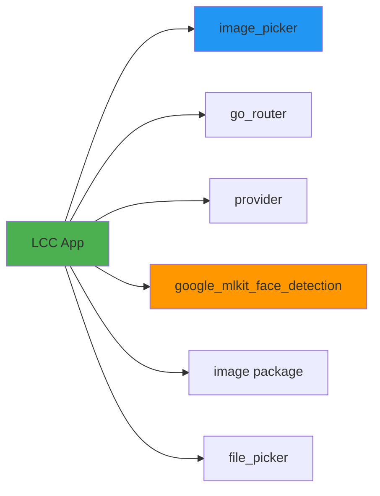
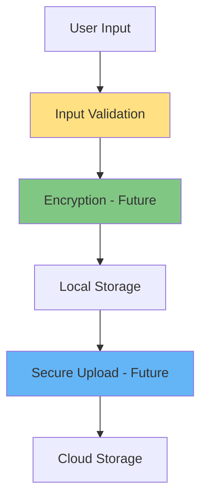
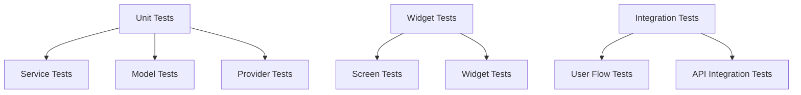

# 🏗️ LCC Application Architecture

This document provides a comprehensive overview of the LCC (Loan Credit Card) application architecture, including component relationships, data flow, and system design.

---

## 📊 Architecture Overview

### High-Level Architecture



---

## 🔄 Application Flow

### User Journey Flow



---

## 🧩 Component Architecture

### Layer Breakdown



---

## 📦 Data Flow Architecture

### State Management Flow



---

## 🗂️ Detailed Component Structure

### 1. Presentation Layer (Screens)

```
lib/screens/
├── splash_screen.dart          # Initial loading
├── branding_screen.dart        # Company branding
├── login_screen.dart           # Authentication
├── instructions_screen.dart    # Process overview
├── terms_screen.dart           # Terms & Conditions
├── step1_selfie_screen.dart    # Selfie capture
├── step2_aadhaar_screen.dart   # Aadhaar upload
├── step3_pan_screen.dart       # PAN upload
├── step4_bank_statement_screen.dart  # Bank statement
├── step5_personal_data_screen.dart   # Personal info form
├── step6_preview_screen.dart   # Review & confirm
└── submission_success_screen.dart     # Success message
```

### 2. State Management (Provider)

```
lib/providers/
└── submission_provider.dart
    ├── DocumentSubmission _submission
    ├── bool _termsAccepted
    ├── setSelfie()
    ├── setAadhaarFront/Back()
    ├── setPanFront()
    ├── setBankStatementPages()
    ├── setPersonalData()
    └── reset()
```

### 3. Business Logic (Services)

```
lib/services/
├── document_service.dart
│   ├── validateSelfie()
│   │   ├── File size check
│   │   ├── Resolution check
│   │   ├── Format validation
│   │   ├── Brightness/Contrast
│   │   ├── Background uniformity
│   │   └── Face detection (ML Kit)
│   └── resizeImage()
└── file_helper_stub.dart       # Web compatibility
```

### 4. Data Models

```
lib/models/
└── document_submission.dart
    ├── DocumentSubmission
    │   ├── String? selfiePath
    │   ├── AadhaarDocument? aadhaar
    │   ├── PanDocument? pan
    │   ├── BankStatement? bankStatement
    │   └── PersonalData? personalData
    ├── PersonalData (26+ fields)
    ├── AadhaarDocument
    ├── PanDocument
    └── BankStatement
```

### 5. Utilities & Widgets

```
lib/utils/
├── app_routes.dart             # Route constants
└── app_theme.dart              # Theme configuration

lib/widgets/
├── premium_button.dart         # Custom button
├── premium_card.dart           # Custom card
├── platform_image.dart         # Cross-platform image
└── step_progress_indicator.dart # Progress bar
```

---

## 🔌 Integration Points

### Current Integrations



### Future Integrations

```
┌─────────────────┐
│   Backend API   │ ← REST/GraphQL
│   (Future)      │
└─────────────────┘
         ↑
         │
┌─────────────────┐
│  Cloud Storage  │ ← AWS S3 / GCS
│   (Future)      │
└─────────────────┘
         ↑
         │
┌─────────────────┐
│   OCR Service  │ ← Google Vision / AWS Textract
│   (Future)      │
└─────────────────┘
```

---

## 🔐 Security Architecture

### Data Flow Security



### Current Security Measures

- ✅ Input validation on all forms
- ✅ File type validation
- ✅ Image size/resolution checks
- ✅ Error handling and sanitization
- ⏳ Encryption (planned)
- ⏳ Secure API communication (planned)
- ⏳ Token-based authentication (planned)

---

## 📱 Platform Support

### Multi-Platform Architecture

```
                    ┌─────────────┐
                    │  Flutter    │
                    │   Engine    │
                    └──────┬──────┘
                           │
        ┌──────────────────┼──────────────────┐
        │                  │                  │
   ┌────▼────┐      ┌──────▼──────┐    ┌─────▼─────┐
   │ Android │      │     iOS     │    │    Web    │
   └─────────┘      └─────────────┘    └───────────┘
        │                  │                  │
        └──────────────────┼──────────────────┘
                           │
                    ┌──────▼──────┐
                    │  Platform   │
                    │  Adaptations│
                    └─────────────┘
```

### Platform-Specific Handling

- **Web**: Uses `file_helper_stub.dart` for file operations
- **Mobile**: Native file system access via `dart:io`
- **Image Display**: `PlatformImage` widget handles both platforms

---

## 🧪 Testing Architecture

### Testing Layers (Planned)



---

## 🚀 Deployment Architecture

### Build Targets

```
┌─────────────────────────────────────┐
│         Flutter Build              │
└──────────────┬──────────────────────┘
               │
    ┌──────────┼──────────┐
    │          │          │
┌───▼───┐ ┌───▼───┐ ┌───▼───┐
│  APK  │ │  iOS  │ │  Web  │
│  AAB  │ │  IPA  │ │  HTML │
└───────┘ └───────┘ └───────┘
```

---

## 📈 Performance Considerations

### Optimization Strategies

1. **Image Processing**
   - Resize images before validation
   - Limit file sizes (20MB for loading, 5MB for face detection)
   - Use timeouts for long operations

2. **State Management**
   - Use `context.watch()` only when needed
   - Use `context.read()` for one-time operations
   - Check `mounted` before `setState()`

3. **Memory Management**
   - Clean up temporary files
   - Dispose controllers properly
   - Use `const` constructors where possible

---

## 🔄 Navigation Architecture

### Route Structure

```mermaid
graph LR
    SPLASH[/] --> BRANDING[/branding]
    BRANDING --> LOGIN[/login]
    LOGIN --> HOME[/home]
    HOME --> TERMS[/terms]
    HOME --> STEP1[/step1-selfie]
    STEP1 --> STEP2[/step2-aadhaar]
    STEP2 --> STEP3[/step3-pan]
    STEP3 --> STEP4[/step4-bank-statement]
    STEP4 --> STEP5[/step5-personal-data]
    STEP5 --> STEP6[/step6-preview]
    STEP6 --> SUCCESS[/submission-success]
    SUCCESS --> HOME
```

---

## 📝 Key Design Decisions

### 1. State Management
- **Choice**: Provider pattern
- **Reason**: Simple, built-in Flutter support, sufficient for current needs
- **Alternative Considered**: Riverpod, Bloc

### 2. Navigation
- **Choice**: GoRouter
- **Reason**: Declarative routing, type-safe, deep linking support
- **Alternative Considered**: Navigator 2.0, AutoRoute

### 3. Image Processing
- **Choice**: `image` package + Google ML Kit
- **Reason**: Cross-platform, good performance, face detection support
- **Alternative Considered**: Firebase ML, custom solutions

### 4. File Handling
- **Choice**: Platform-agnostic approach with stubs
- **Reason**: Support both web and mobile with same codebase
- **Alternative Considered**: Platform channels

---

## 🔮 Future Architecture Enhancements

### Planned Additions

1. **Backend Integration Layer**
   ```
   lib/services/
   ├── api_service.dart
   ├── auth_service.dart
   └── upload_service.dart
   ```

2. **Offline Support**
   ```
   lib/services/
   ├── offline_queue.dart
   └── sync_service.dart
   ```

3. **Caching Layer**
   ```
   lib/services/
   └── cache_service.dart
   ```

4. **Analytics & Monitoring**
   ```
   lib/services/
   ├── analytics_service.dart
   └── error_tracking.dart
   ```

---

## 📚 References

- [Flutter Architecture](https://docs.flutter.dev/development/data-and-backend/state-mgmt)
- [Provider Package](https://pub.dev/packages/provider)
- [GoRouter](https://pub.dev/packages/go_router)
- [Google ML Kit](https://developers.google.com/ml-kit)

---

**Last Updated:** January 2025  
**Version:** 1.0.0

